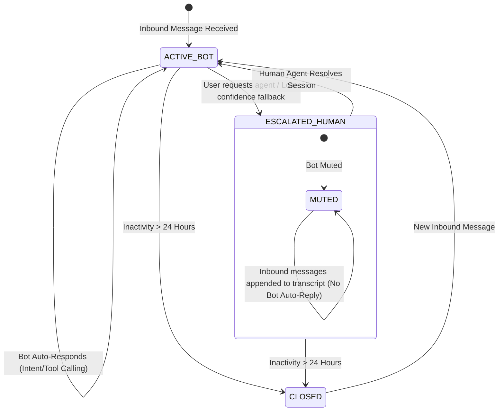

# Domain Context & Architectural Decision Records (ADR)
## Project: `whatsapp-support-gateway`

---

## 1. Target Domain: E-Commerce Customer Support

The reference domain for this gateway is an **E-Commerce Customer Care System**:
- **Core Entities**:
  - `Customer`: Phone number (WhatsApp ID), name, order history.
  - `Order`: Order ID (`#ORD-1001`), status (`PROCESSING`, `SHIPPED`, `DELIVERED`, `CANCELLED`), tracking carrier, delivery ETA, line items.
  - `ReturnRequest`: Order ID, item SKU, reason, return eligibility.
  - `SupportTicket`: Escalated ticket for human intervention with priority and conversation transcript.

---

## 2. Domain Glossary

| Term | Definition |
| :--- | :--- |
| **WAMID** | WhatsApp Message ID (`wamid.HBg...`). Unique identifier assigned by Meta to every inbound and outbound message. Used as an idempotency key to prevent duplicate processing. |
| **Customer Care Window** | A rolling 24-hour window triggered by an inbound user message. Within this window, the business can send free-form session messages without pre-approved template charges. |
| **Webhook Verification** | The handshake mechanism (`GET /webhook` with `hub.mode`, `hub.challenge`, and `hub.verify_token`) mandated by Meta to verify server ownership. |
| **Payload Signature** | SHA-256 HMAC signature sent in the `X-Hub-Signature-256` header, calculated using the Meta App Secret to ensure authenticity and integrity of incoming payloads. |
| **Intent Router** | The decision engine that classifies customer messages into explicit operational workflows (`ORDER_STATUS`, `FAQ`, `HUMAN_ESCALATION`, `UNKNOWN`). |
| **Bounded Tool Execution** | A restricted runtime where the AI engine can only execute predefined, strictly validated function calls against backend systems with typed Pydantic schemas. |
| **Human Handoff** | A state machine transition where bot automation is muted for a customer session, alerting human support agents and capturing transcript history. |
| **Outbound Dispatcher** | The outbound adapter responsible for delivering messages to the WhatsApp Cloud API, handling token auth, rate limits, retries, and exponential backoff. |

---

## 3. Session State Machine

---

## 4. Architectural Decision Records (ADRs)

### ADR-001: Hexagonal Ports & Adapters for WhatsApp Channel
- **Status**: Accepted
- **Context**: Relying solely on live Meta WhatsApp Cloud credentials breaks local testability, blocks CI/CD pipelines, and forces portfolio reviewers to configure complex Meta developer accounts and ngrok tunnels.
- **Decision**: Define a formal `WhatsAppChannelPort` (Protocol) decoupling business logic from Meta's wire format. Provide two implementations:
  1. `MetaCloudAPIAdapter`: Production adapter supporting Graph API v20.0+, HMAC verification, and cloud delivery.
  2. `MockWhatsAppAdapter` + Local CLI / Webhook Simulator: In-memory adapter enabling 100% offline unit/integration test coverage and zero-friction interactive demonstrations.
- **Consequences**: Zero external onboarding friction for reviewers and clients; production readiness for real deployment.

### ADR-002: Ingestion Decoupling & Pluggable Queue Architecture
- **Status**: Accepted
- **Context**: Meta requires an `HTTP 200 OK` response within 3 seconds. LLM reasoning or database queries can exceed this threshold, triggering Meta retry storms and message duplication.
- **Decision**: Decouple ingestion from execution. Webhooks return `HTTP 200 OK` in < 30ms after signature and idempotency checks. Define a `QueuePort` with:
  1. `InProcessAsyncQueue`: Default zero-dependency queue (`asyncio.Queue` + worker pool) for single-container execution.
  2. `RedisQueueAdapter`: Optional drop-in for horizontal multi-container scaling when `REDIS_URL` is set.
- **Consequences**: Immediate response time; zero-dependency local startup; horizontally scalable in production.

### ADR-003: OpenAI-Compatible Open-Weight Model Layer (Ollama / Groq / vLLM)
- **Status**: Accepted
- **Context**: Clients and developers frequently require private, cost-effective, or locally hosted open-weight models (Qwen, Llama) rather than being locked into proprietary OpenAI/Anthropic APIs.
- **Decision**: Implement the LLM engine using an OpenAI-compatible interface supporting structured tool calling (function calling). Target **Qwen 2.5 / Qwen 3 (7B/8B)** and **Llama 3.1 8B Instruct** as primary open-weight models, deployable via:
  - Local Ollama (`http://localhost:11434/v1`)
  - Cloud Open-Weight APIs (Groq / Together / DeepInfra)
  - Deterministic Mock LLM for offline tests and predictable CI/CD.
- **Consequences**: Free, private, and local execution with zero API subscription costs for testing.

### ADR-004: Persistent State Store & Idempotency Cache
- **Status**: Accepted
- **Context**: Network retries deliver duplicate `WAMID` events. Furthermore, session state (active bot vs. human escalation) must survive process restarts.
- **Decision**: Implement an `IdempotencyStore` and `SessionStore` backed by SQLite (with in-memory fallback for unit tests). Every inbound `WAMID` is checked before processing.
- **Consequences**: Prevents duplicate execution and ensures escalation state persistence.
